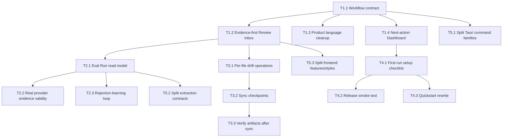

# Production Improvement Roadmap

> Generated by spec-driven-develop Phase 2/3 draft on 2026-05-18. This is a planning proposal, not yet synchronized to GitHub Issues.

## Refined Task Definition

Make Agent Memory Kernel feel like a practical production tool for its owner and early Windows users by hardening one daily workflow:

```text
Select project
  -> run evolution
  -> review a small number of evidence-backed suggestions
  -> approve/edit/reject
  -> assign to Codex / Claude Code
  -> preview exact artifact diff
  -> sync safely
  -> verify and recover if needed
```

The goal is not to add more concepts. The goal is to make the current concepts disappear behind a trustworthy loop.

## Recommended Strategy

Use a "workflow-first hardening" strategy:

1. Pick one golden path and make it excellent.
2. Put evidence and artifact diffs at the center of every approval.
3. Turn eval results into product-visible confidence, not just developer reports.
4. Move secondary surfaces like Catalog and advanced provider tuning behind the core loop.
5. Refactor modules only where they block the workflow or verification.

## Phase 1 - Daily Workflow Reset

Goal: make the app's first project screen tell the user exactly what to do next.

### T1.1 Define the canonical v1 workflow contract

- Priority: P0
- Size: M
- S.U.P.E.R drivers: S, U, P
- Affected areas: docs, frontend read models, app service
- Acceptance criteria:
  - The v1 workflow is documented as a sequence of states and transitions.
  - Each state has exactly one primary next action.
  - Internal terms are mapped to product terms: Suggestion, Memory Card, Loadout, Artifact.
  - The UI can compute "next best action" from read models without guessing.

### T1.2 Make Review Inbox evidence-first

- Priority: P0
- Size: L
- S.U.P.E.R drivers: S, P, R
- Affected areas: `Drafts.tsx`, `review-workbench.ts`, candidate/draft read models
- Acceptance criteria:
  - Selecting a suggestion shows source, quote/evidence, recurrence, confidence, risk, suggested action, and target artifact impact.
  - Approve is visually downstream of evidence review and artifact impact.
  - Low-confidence or one-off candidates are visually separated from durable suggestions.
  - Tests cover evidence summary, risk labels, and next-action state.

### T1.3 Collapse Candidate/Draft language in UI

- Priority: P0
- Size: M
- S.U.P.E.R drivers: S, U
- Affected areas: Review UI, docs, labels
- Acceptance criteria:
  - Users see "Suggestion" and "Approved Memory Card" as the main concepts.
  - Candidate/Draft may remain internal implementation details.
  - Batch actions remain available but use product language.

### T1.4 Make Dashboard a next-action cockpit

- Priority: P0
- Size: M
- S.U.P.E.R drivers: S, U
- Affected areas: app shell, dashboard/read models
- Acceptance criteria:
  - Empty project state explains one next action: import/evolve.
  - Non-empty state highlights pending suggestions, drift blockers, failed jobs, and unsynced approved cards.
  - Every warning links to the relevant page/action.

## Phase 2 - Trust, Evidence, And Evaluation

Goal: make quality claims measurable and visible.

### T2.1 Promote Eval Run to a first-class read model

- Priority: P0
- Size: L
- S.U.P.E.R drivers: P, E, R
- Affected areas: `src/eval.rs`, app service, UI
- Acceptance criteria:
  - Latest golden-set result can be loaded by the UI.
  - Metrics include recall, precision, one-off false positives, duplicate risk, evidence validity, provider used, pipeline version, and timestamp.
  - Failed metrics produce actionable recommendations.

### T2.2 Capture real provider evidence validity

- Priority: P0
- Size: M
- S.U.P.E.R drivers: P, E
- Affected areas: eval CLI, provider layer, fixtures
- Acceptance criteria:
  - A configured-provider eval run can be captured and stored.
  - Hallucinated or untraceable evidence is recorded as a failure category.
  - New failures can be promoted into golden fixtures.

### T2.3 Build a rejection-learning loop

- Priority: P1
- Size: L
- S.U.P.E.R drivers: U, P, R
- Affected areas: candidate rejection, feedback log, eval fixtures
- Acceptance criteria:
  - User rejection reasons can be categorized.
  - Rejected suggestions can be converted into negative eval examples.
  - The next eval report shows whether similar false positives were reduced.

## Phase 3 - Artifact Sync And Recovery Hardening

Goal: make writing to AGENTS.md/CLAUDE.md feel safe and reversible.

### T3.1 Add per-file drift operations to the UI

- Priority: P1
- Size: M
- S.U.P.E.R drivers: S, P, R
- Affected areas: artifact drift backend and UI
- Acceptance criteria:
  - Each drifted artifact can be imported, kept, or discarded independently.
  - Destructive discard remains explicitly confirmed.
  - Large drift sets are paginated and do not block unrelated clean artifacts.

### T3.2 Add sync checkpoints and rollback guidance

- Priority: P1
- Size: L
- S.U.P.E.R drivers: E, R
- Affected areas: build/sync, audit log, UI
- Acceptance criteria:
  - Each sync creates a checkpoint record with artifact paths and hashes.
  - The UI can show last sync summary and rollback instructions/actions.
  - Audit log links sync to approved Memory Cards.

### T3.3 Verify generated artifacts after sync

- Priority: P1
- Size: M
- S.U.P.E.R drivers: U, P
- Affected areas: rule tests, build status, UI
- Acceptance criteria:
  - Sync completion includes rule/test result status.
  - Failures are surfaced as next actions.
  - The user can copy or run a "reload agent instructions" prompt after sync.

## Phase 4 - Onboarding And Distribution

Goal: make first-run setup boring on Windows.

### T4.1 Create first-run setup checklist

- Priority: P1
- Size: M
- S.U.P.E.R drivers: E
- Affected areas: app shell, settings, docs
- Acceptance criteria:
  - The app shows whether Rust/Bun/dev mode are needed or irrelevant for installer users.
  - Provider status can be tested.
  - Missing provider/proxy/config errors are actionable.

### T4.2 Release smoke test workflow

- Priority: P1
- Size: M
- S.U.P.E.R drivers: E, R
- Affected areas: CI/release
- Acceptance criteria:
  - Release workflow verifies installer artifact creation.
  - A minimal post-build CLI/app smoke check runs on Windows.
  - Release notes state known limitations.

### T4.3 Public quickstart rewrite around one workflow

- Priority: P2
- Size: S
- S.U.P.E.R drivers: S
- Affected areas: README, quickstart
- Acceptance criteria:
  - Quickstart starts from the desktop daily loop, not internal CLI taxonomy.
  - CLI remains documented for developers.
  - Privacy and safety guarantees are clear.

## Phase 5 - Workflow-Shaped Architecture Cleanup

Goal: reduce future development friction without a rewrite.

### T5.1 Split Tauri command families

- Priority: P1
- Size: L
- S.U.P.E.R drivers: S, U, R
- Affected areas: `src-tauri/src/commands/core.rs`
- Acceptance criteria:
  - Commands are grouped by project, review, memory, assignment, artifact, jobs, provider.
  - Existing command names and frontend compatibility are preserved.
  - Tests continue to pass.

### T5.2 Split extraction pipeline contracts

- Priority: P1
- Size: XL
- S.U.P.E.R drivers: S, P, R
- Affected areas: `src/extract/*`, eval tests
- Acceptance criteria:
  - Pipeline stages expose explicit input/output structs.
  - Metrics are emitted consistently per stage.
  - Golden-set results are unchanged or improved.

### T5.3 Split frontend features and styles

- Priority: P1
- Size: L
- S.U.P.E.R drivers: S, R
- Affected areas: `app/src/components/pages/*`, CSS
- Acceptance criteria:
  - Review Inbox, Memory Library, Agent Loadout, Artifact Preview, Jobs, and Settings each own local components/styles.
  - Global CSS contains only tokens and shell primitives.
  - No visual regression on the golden path.

## Dependency Graph



## GitHub Synchronization Proposal

Because `GITHUB_FULL` is available, after user confirmation this roadmap can be synchronized as:

- Project: `Spec: Agent Memory Kernel Production Tooling`
- Milestones:
  - Phase 1: Daily Workflow Reset
  - Phase 2: Trust, Evidence, And Evaluation
  - Phase 3: Artifact Sync And Recovery Hardening
  - Phase 4: Onboarding And Distribution
  - Phase 5: Workflow-Shaped Architecture Cleanup
- Labels:
  - `spec-driven`
  - `priority:P0`, `priority:P1`, `priority:P2`
  - `size:S`, `size:M`, `size:L`, `size:XL`
  - `phase:1` through `phase:5`
  - `lane:ui`, `lane:core`, `lane:eval`, `lane:release`

Do not create these GitHub resources until the user confirms the scope.
