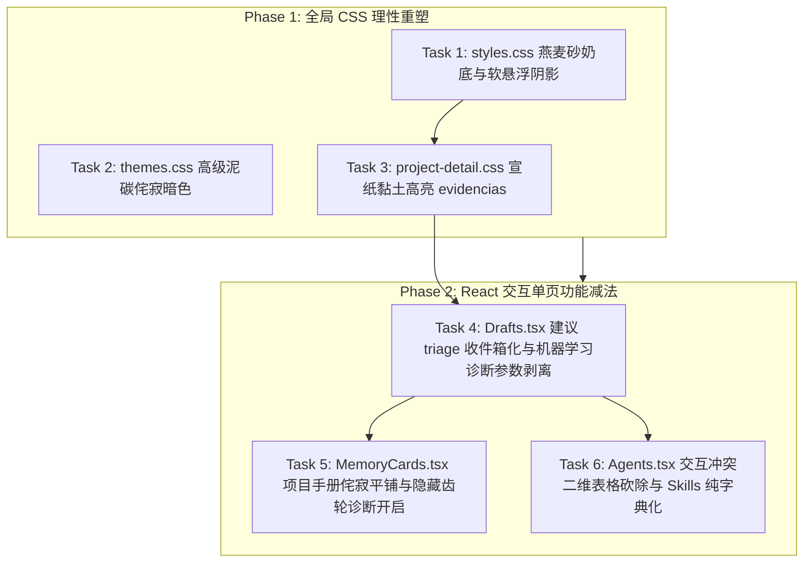

# Task Dependency Graph

```mermaid
graph TD
    subgraph Phase1 [Phase 1: 全局 CSS 理性重塑]
        T1[Task 1: styles.css 燕麦砂奶底与软悬浮阴影]
        T2[Task 2: themes.css 高级泥碳侘寂暗色]
        T3[Task 3: project-detail.css 宣纸黏土高亮 evidencias]
        T1 --> T3
    end

    subgraph Phase2 [Phase 2: React 交互单页功能减法]
        T4[Task 4: Drafts.tsx 建议 triage 收件箱化与机器学习诊断参数剥离]
        T5[Task 5: MemoryCards.tsx 项目手册侘寂平铺与隐藏齿轮诊断开启]
        T6[Task 6: Agents.tsx 交互冲突二维表格砍除与 Skills 纯字典化]
        T3 --> T4
        T4 --> T5
        T4 --> T6
    end

    Phase1 --> Phase2
```
